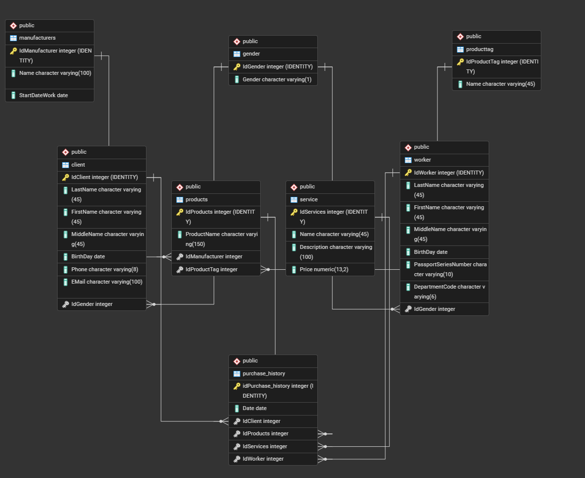
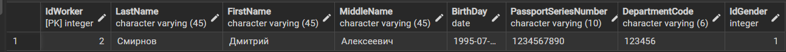

# Учебная работа «Проверка основных ограничений в базе данных магазина»

__Цель работы__: проверить основные ограничения в базе данных магазина. Для достижения этой цели необходимо решить задачи создание таблиц с ограничениями, проверка соблюдения ограничений 

__Язык__: SQL

__Среда__: PostgreSQL

__Структура репозитория__:
create_tables.sql – это файл, содержащий SQL-команды для создания таблиц с ограничениями.
insert_data.sql – файл для заполнения таблиц тестовыми данными.
queries.sql – файл с примерами запросов к таблицам (SELECT, UPDATE).
constraints_tests.sql – файл с наборами тестов для проверки ограничений.

## Описание базы данных.
Разработанная база данных для цветочного магазина хранит следующую информацию в таблцах:
1 gender — справочник полов
* IdGender — уникальный идентификатор пола (автоинкремент)
* Gender — обозначение пола ('М' или 'Ж')
2 client — клиенты магазина
* IdClient — идентификатор клиента
* LastName, FirstName, MiddleName — фамилия, имя, отчество
* BirthDay — дата рождения
* Phone — телефон (8 символов)
* EMail — электронная почта
* IdGender — ссылка на пол клиента (внешний ключ к gender)
3 manufacturers — производители цветов
* IdManufacturer — идентификатор производителя
* Name — название организации
* StartDateWork — дата начала работы (сотрудничества)
4 producttag — теги (категории) товаров
* IdProductTag — идентификатор тега
* Name — название тега (например, «Роза белая», «Тюльпан»)
5 products — товары 
* IdProducts — идентификатор товара
* ProductName — наименование товара
* IdManufacturer — ссылка на производителя (внешний ключ к manufacturers)
* IdProductTag — ссылка на тег (внешний ключ к producttag)
6 service — услуги (например, доставка)
* IdServices — идентификатор услуги
* Name — название услуги
* Description — описание
* Price — стоимость (числовой тип с двумя знаками после запятой, обязательно > 0)
7 worker — сотрудники магазина
* IdWorker — идентификатор сотрудника
* LastName, FirstName, MiddleName — ФИО
* BirthDay — дата рождения
* PassportSeriesNumber — серия и номер паспорта (10 символов)
* DepartmentCode — код подразделения (6 символов)
* IdGender — ссылка на пол (внешний ключ к gender)
8 purchase_history — история покупок
* idPurchase_history — идентификатор записи о покупке
* Date — дата покупки
* IdClient — ссылка на клиента (внешний ключ к client)
* IdProducts — ссылка на товар (внешний ключ к products)
* IdServices — ссылка на услугу (внешний ключ к service)
* IdWorker — ссылка на сотрудника, обслужившего покупку (внешний ключ к worker)

__ERD диаграмма базы данных__.

## Проверка ограничений.
__Ограничения целостности__:
* PRIMARY KEY – уникальность и не NULL для идентификаторов;
* NOT NULL – обязательность заполнения полей;
* CHECK – проверка допустимых значений (например, цена > 0);
* FOREIGN KEY – ссылочная целостность (нельзя удалить категорию, если есть товары).

__Тесты__
* тест 1. Проверка корректности вставки новой записи в таблицу "worker".
результат: 

* тест 2. Попытка добавить заказ с отрицательной ценой.
результат: ОШИБКА:  новая строка в отношении "service" нарушает ограничение-проверку "price_positive"
SQL state: 23514
Detail: Ошибочная строка содержит (2, Тестовая услуга, Описание тестовой услуги, -150.00).
* тест 3. добавление товара без заполнения обязательного поля.
результат: ERROR:  значение NULL в столбце "ProductName" отношения "products" нарушает ограничение NOT NULL
Ошибочная строка содержит (5, null, 1, 1).
* тест 4. Удаление категории, к которой привязаны товары.
результат: ОШИБКА:  UPDATE или DELETE в таблице "manufacturers" нарушает ограничение внешнего ключа "products_IdManufacturer_fkey" таблицы "products"
SQL state: 23503
Detail: На ключ (IdManufacturer)=(1) всё ещё есть ссылки в таблице "products".

